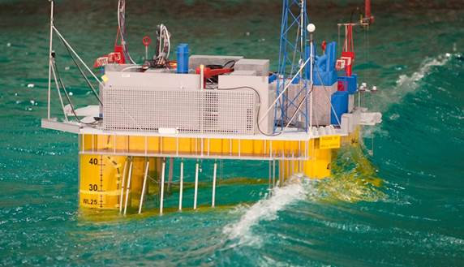
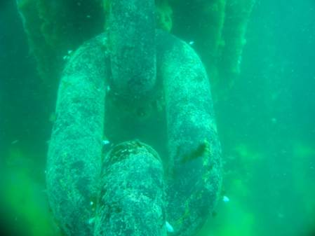
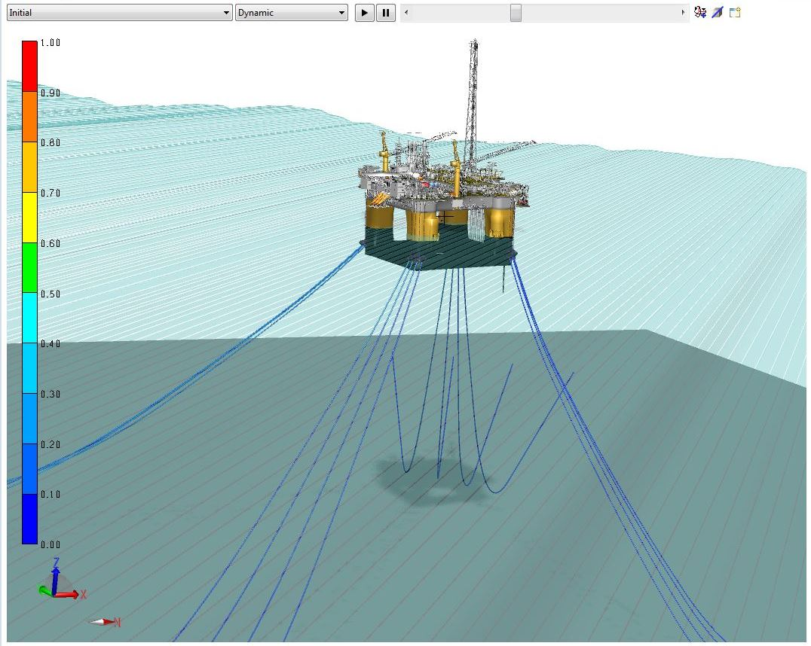
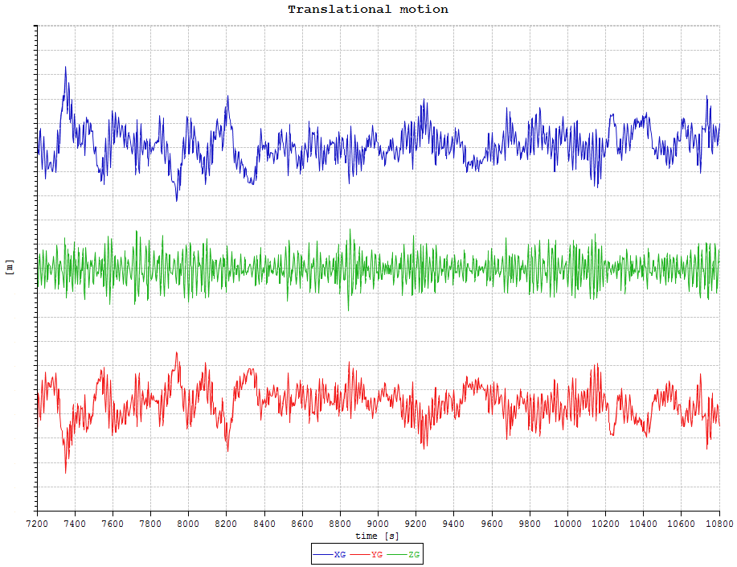
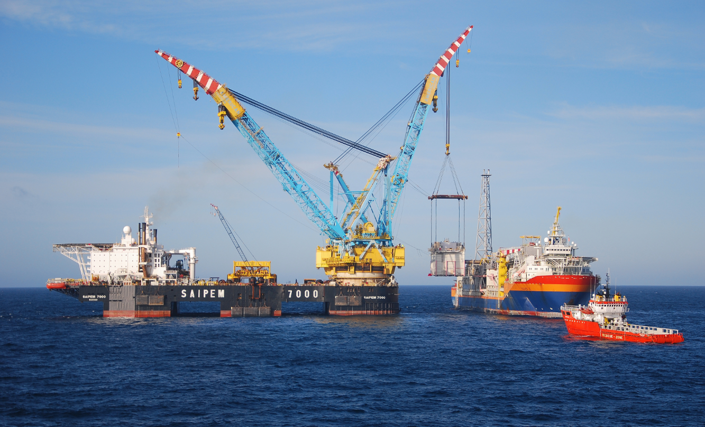
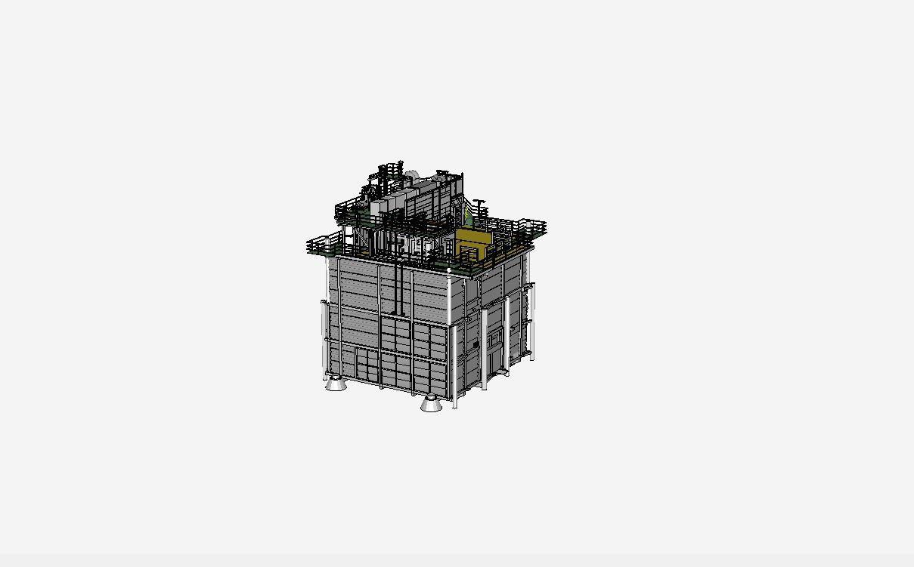
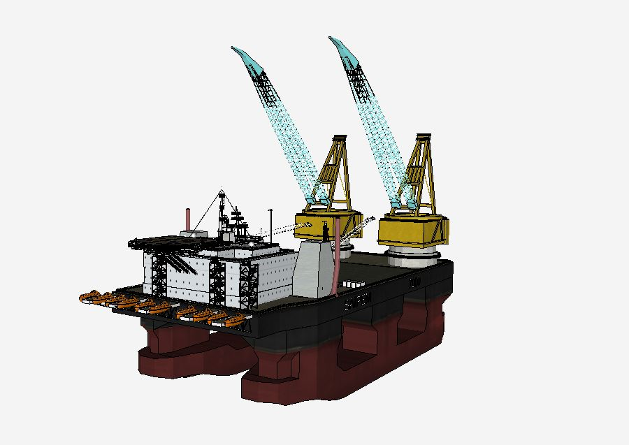
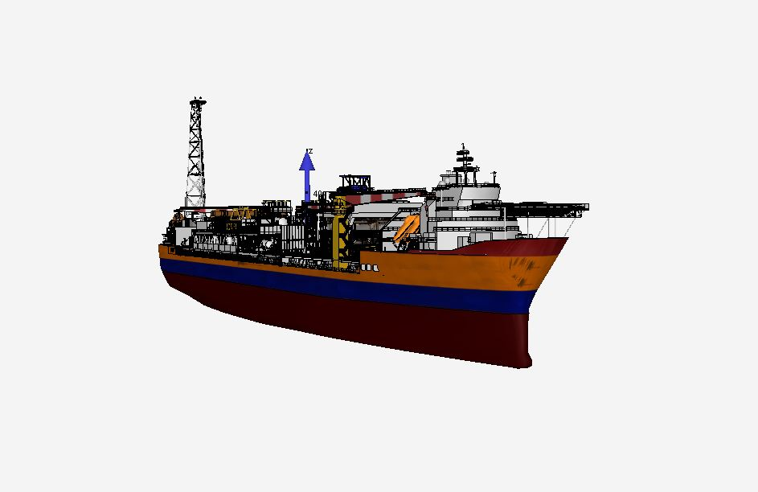

## Welcome to Modelshare

This website provides access to various numerical and 3D-models with respectively related model information. The models are found in the Model archive, and are categorized based on type and usage.

### SIMA models

Models for advanced simulations in SIMA of motion and mooring system and risers/umbilicals responses.

### 3D models

Graphical models for visualization and for analyses that require 3D geometry as input.

### Terms of use

By using this website, you accept these [terms and conditions](terms.md "Terms and conditions") in full. If you disagree with these terms and conditions or any part of these terms and conditions, you must not use this website.

